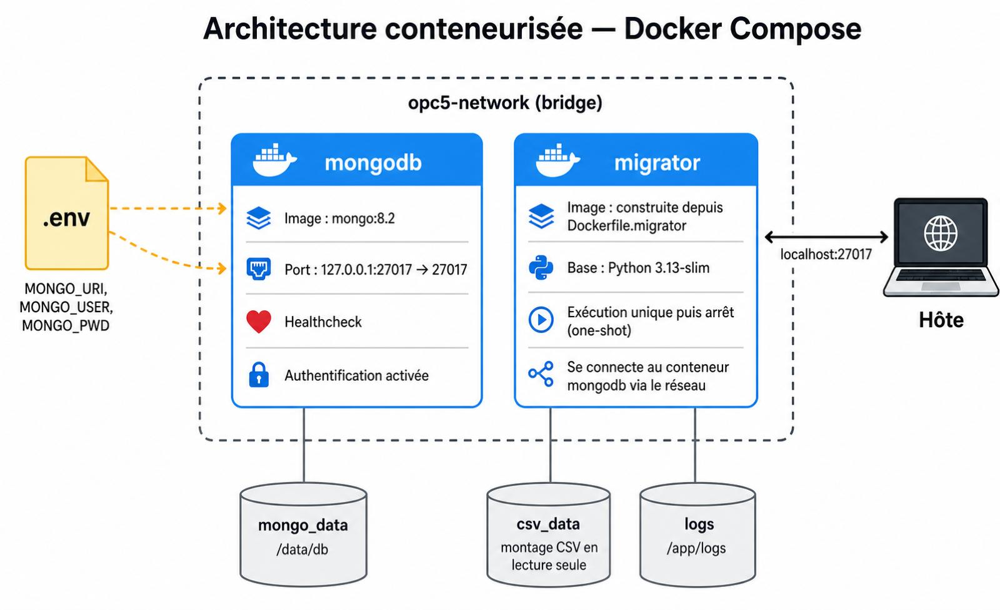
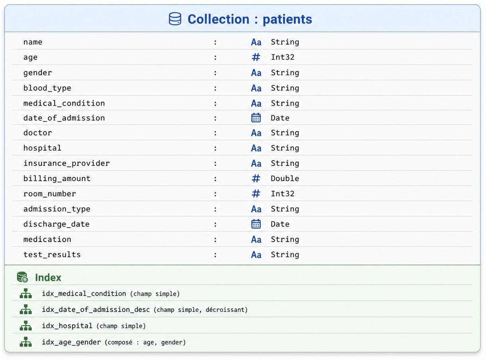

# OPC5 — Maintenez et documentez un système de stockage des données sécurisé et performant

> Projet 5 de la formation **Data Engineer OpenClassrooms** — Migration d'un dataset médical CSV vers MongoDB, conteneurisé via Docker, avec authentification, rôles utilisateurs, tests automatisés et exploration des options AWS.

---

## Sommaire

- [OPC5 — Maintenez et documentez un système de stockage des données sécurisé et performant](#opc5--maintenez-et-documentez-un-système-de-stockage-des-données-sécurisé-et-performant)
  - [Sommaire](#sommaire)
  - [1. Contexte et objectifs](#1-contexte-et-objectifs)
  - [2. Architecture](#2-architecture)
  - [3. Schéma de la base de données](#3-schéma-de-la-base-de-données)
    - [Champs](#champs)
    - [Index](#index)
  - [4. Sécurité — authentification et rôles](#4-sécurité--authentification-et-rôles)
    - [Trois comptes différenciés (principe du moindre privilège)](#trois-comptes-différenciés-principe-du-moindre-privilège)
    - [Mise en œuvre](#mise-en-œuvre)
    - [Gestion des secrets](#gestion-des-secrets)
    - [Validation](#validation)
  - [5. Prérequis](#5-prérequis)
  - [6. Installation et lancement](#6-installation-et-lancement)
    - [Première utilisation](#première-utilisation)
    - [Vérifications](#vérifications)
    - [Arrêt et nettoyage](#arrêt-et-nettoyage)
  - [7. Logique de la migration](#7-logique-de-la-migration)
    - [Démonstration CRUD](#démonstration-crud)
    - [Export](#export)
  - [8. Tests](#8-tests)
  - [9. Structure du dépôt](#9-structure-du-dépôt)
  - [10. Recherches AWS](#10-recherches-aws)
  - [11. Décisions techniques](#11-décisions-techniques)
  - [12. Matrice consigne / livrables / preuves](#12-matrice-consigne--livrables--preuves)
  - [13. État d'avancement](#13-état-davancement)
  - [14. Limites connues](#14-limites-connues)
  - [15. Auteur et contexte de formation](#15-auteur-et-contexte-de-formation)

---

## 1. Contexte et objectifs

**Mission DataSoluTech (scénario fictif).** Le client, acteur du secteur médical, rencontre des problèmes de scalabilité sur ses traitements quotidiens. La solution proposée est une infrastructure NoSQL conteneurisée :

- **Migrer** un dataset médical (CSV ~55 000 lignes) vers MongoDB.
- **Conteneuriser** la base et le pipeline via Docker / Docker Compose.
- **Sécuriser** l'accès (authentification + rôles différenciés).
- **Tester** l'intégrité avant/après migration.
- **Documenter** une trajectoire d'évolution vers AWS (S3, RDS, DocumentDB, ECS).

---

## 2. Architecture



**Vue d'ensemble — services Docker Compose :**

| Service | Rôle | Image | Cycle de vie |
|---|---|---|---|
| `mongodb` | Base NoSQL avec authentification | `mongo:8.2` | Service permanent |
| `migrator` | Pipeline ETL CSV → MongoDB | Image custom (`Dockerfile.migrator`, base `python:3.13-slim`) | Job one-shot, exit 0 |

**Flux de données :**

1. Au premier démarrage de la stack, `mongodb` lit `mongo-init/init-users.js` et crée les comptes applicatifs (`migration_user`, `analyst_user`).
2. Le healthcheck Mongo passe à `healthy` → `migrator` démarre.
3. `migrator` lit `data/healthcare_dataset.csv` (volume hôte), valide, transforme, insère et indexe.
4. `migrator` se termine avec `exit 0`. La stack reste en place avec uniquement `mongodb` actif.

**Réseau et volumes :**

- Réseau interne `opc5-network` : les services se résolvent par leur nom (`mongodb` au lieu de `localhost`).
- Volume nommé `mongo_data` : persistance des données MongoDB entre redémarrages.
- Bind mount `./data` → `/app/data` (lecture seule) : alimente le migrator en CSV source.
- Port `27017` exposé sur `127.0.0.1` uniquement (accessible depuis l'hôte via MongoDB Compass, mais pas depuis le réseau).

*Détails techniques justifiés dans [`DECISIONS.md`](./DECISIONS.md).*

---

## 3. Schéma de la base de données



**Base :** `healthcare_db`
**Collection :** `patients`
**Volumétrie :** 54 966 documents (après dédoublonnage de 534 lignes du CSV source).

### Champs

| Champ | Type | Description | Origine CSV | Indexé |
|---|---|---|---|---|
| `_id` | ObjectId | Identifiant interne MongoDB | (généré) | par défaut |
| `name` | string | Nom du patient (Title Case normalisé) | `Name` | — |
| `age` | int | Âge en années | `Age` | `idx_age_gender` |
| `gender` | string | Genre | `Gender` | `idx_age_gender` |
| `blood_type` | string | Groupe sanguin | `Blood Type` | — |
| `medical_condition` | string | Pathologie principale | `Medical Condition` | `idx_medical_condition` |
| `date_of_admission` | datetime | Date d'admission | `Date of Admission` | `idx_date_of_admission_desc` |
| `doctor` | string | Médecin référent (Title Case) | `Doctor` | — |
| `hospital` | string | Établissement | `Hospital` | `idx_hospital` |
| `insurance_provider` | string | Assurance | `Insurance Provider` | — |
| `billing_amount` | float | Montant facturé | `Billing Amount` | — |
| `room_number` | int | Numéro de chambre | `Room Number` | — |
| `admission_type` | string | Type d'admission | `Admission Type` | — |
| `discharge_date` | datetime | Date de sortie | `Discharge Date` | — |
| `medication` | string | Médicament prescrit | `Medication` | — |
| `test_results` | string | Résultat des analyses | `Test Results` | — |

### Index

4 index applicatifs créés en plus de `_id` :

| Nom | Type | Clé(s) | Cas d'usage |
|---|---|---|---|
| `idx_medical_condition` | simple ascendant | `medical_condition` | Filtre par pathologie (cardinalité : 6 valeurs) |
| `idx_date_of_admission_desc` | simple descendant | `date_of_admission` | Récupération des admissions récentes (dashboards) |
| `idx_hospital` | simple ascendant | `hospital` | Filtre par établissement (cardinalité : 39 876) |
| `idx_age_gender` | composé | `age` + `gender` | Analyses démographiques croisées |

Justifications détaillées dans `DECISIONS.md`. Vérification du recours effectif aux index (`IXSCAN` au lieu de `COLLSCAN`) automatisée dans `tests/test_mongo_integrity.py::test_query_uses_index`.

---

## 4. Sécurité — authentification et rôles

L'authentification MongoDB est **active** dès le premier démarrage de la stack. Tout accès non authentifié est refusé, y compris les opérations de lecture.

### Trois comptes différenciés (principe du moindre privilège)

| Compte | Rôle MongoDB | Base | Usage |
|---|---|---|---|
| `admin` | `root` | `admin` | Administration ponctuelle (création d'utilisateurs, opérations système) |
| `migration_user` | `readWrite` | `healthcare_db` | Pipeline de migration et exports |
| `analyst_user` | `read` | `healthcare_db` | Consultation par les analystes (lecture seule) |

### Mise en œuvre

- **Compte `admin`** : créé automatiquement par l'image officielle Mongo via les variables d'environnement `MONGO_INITDB_ROOT_USERNAME` et `MONGO_INITDB_ROOT_PASSWORD`.
- **Comptes applicatifs** : créés au premier démarrage via le script `mongo-init/init-users.js` monté en read-only dans `/docker-entrypoint-initdb.d/`. Les mots de passe sont injectés via `process.env`.
- **Activation de l'auth** : dès qu'un compte root existe, MongoDB redémarre automatiquement avec `--auth`, ce qui rend toute connexion anonyme impossible.

### Gestion des secrets

- Mots de passe dans `.env` à la racine (non versionné, voir `.gitignore`).
- `.env.example` versionné documente les variables attendues, sans les valeurs.
- En production cloud, `.env` serait remplacé par AWS Secrets Manager ou équivalent (cf. `docs/aws_research.md`).

### Validation

Tests manuels documentés dans **[`docs/security_tests.md`](./docs/security_tests.md)**, qui prouvent notamment :
- Le compte `admin` voit bien les deux comptes applicatifs (`getUsers()`).
- Une connexion anonyme est refusée avec `Unauthorized`.
- `migration_user` peut lire et écrire sur `healthcare_db`.
- `analyst_user` peut lire mais reçoit `not authorized` en cas de tentative d'écriture.

Cette dernière vérification constitue la preuve concrète du moindre privilège.

---

## 5. Prérequis

- **Docker Desktop** ≥ 4.4.2.
- **Git**.
- (Facultatif) **MongoDB Compass** pour inspection visuelle.

**Aucune dépendance hôte côté Python n'est requise** pour faire tourner le projet — tout est conteneurisé. L'environnement Python local (`uv`, Python 3.13) n'est nécessaire que pour exécuter les tests pytest depuis l'hôte.

OS testés : Windows 11 Pro. Linux et macOS attendus compatibles (rien de spécifique à Windows dans la stack).

---

## 6. Installation et lancement

### Première utilisation

```bash
# 1. Cloner le repo
git clone https://github.com/<USERNAME>/OPC5-Maintenez_et_documentez_un_systeme_de_stockage_des_donnees_securise_et_performant.git
cd OPC5-Maintenez_et_documentez_un_systeme_de_stockage_des_donnees_securise_et_performant

# 2. Récupérer le dataset
# Le dataset Kaggle n'est pas versionné. Le télécharger ici :
# https://www.kaggle.com/datasets/prasad22/healthcare-dataset
# puis placer healthcare_dataset.csv dans ./data/

# 3. Configurer les variables d'environnement
cp .env.example .env
# Éditer .env pour définir des mots de passe.

# 4. Lancer la stack
docker compose up --build
```

Au premier `up`, le déroulement attendu est :
1. Construction de l'image `migrator` (~30 s la première fois, instantané ensuite).
2. Démarrage de Mongo en mode init (sans auth) pour exécuter `init-users.js`.
3. Création automatique des comptes `migration_user` et `analyst_user`.
4. Redémarrage de Mongo avec `--auth` activée.
5. Healthcheck Mongo OK → démarrage du `migrator`.
6. Migration : 54 966 documents insérés en ~1,2 s, 4 index créés.
7. `migrator` exit 0. La stack reste en place avec Mongo actif.

### Vérifications

```bash
# Voir l'état des services
docker compose ps
# Attendu : opc5-mongodb (healthy), opc5-migrator (Exited 0)

# Compter les documents avec le compte applicatif
docker exec opc5-mongodb mongosh --quiet \
  -u migration_user -p <mot_de_passe> \
  --authenticationDatabase healthcare_db \
  --eval "db.getSiblingDB('healthcare_db').patients.countDocuments()"
# Attendu : 54966

# Inspection via MongoDB Compass
# URI : mongodb://migration_user:<pwd>@localhost:27017/healthcare_db?authSource=healthcare_db
```

### Arrêt et nettoyage

```bash
docker compose stop          # arrête les conteneurs (volumes conservés)
docker compose down          # arrête + supprime conteneurs (volumes conservés)
docker compose down -v       # arrête + supprime tout (données perdues, init-users.js se rejouera)
```

---

## 7. Logique de la migration

Le script `src/migrate.py` exécute la séquence suivante :

1. **Connexion MongoDB** avec timeout court (3 s) — échec rapide si le serveur est inaccessible.
2. **Lecture du CSV** via pandas (`data/healthcare_dataset.csv` par défaut).
3. **Validation amont** : présence des 15 colonnes attendues, comptage des valeurs manquantes.
4. **Transformation** :
   - Renommage en snake_case (`Date of Admission` → `date_of_admission`).
   - Title Case sur `name` et `doctor` (le dataset source contient de la casse aléatoire).
   - Parsing explicite des dates (`%Y-%m-%d`).
   - Suppression des doublons stricts (~534 lignes sur 55 500).
5. **Chargement** :
   - Vidage de la collection avant insertion (idempotence).
   - Insertion par batchs de 5 000 (`insert_many` avec `ordered=False`).
6. **Indexation** : 4 index (cf. section 3). Créés **après** l'insertion pour ne pas ralentir le bulk load.
7. **Validation aval** : recompte, vérification de la présence de tous les index attendus.

Tous les événements sont logués en console **et** dans un fichier `logs/migration_YYYYMMDD_HHMMSS.log`.

**Volume traité** : 55 500 lignes en entrée → 54 966 documents en base après dédoublonnage. Migration en ~1,2 s en local.

### Démonstration CRUD

`src/crud.py` est un script pédagogique séparé qui démontre les 4 opérations CRUD sur des documents `Demo` isolés, et qui s'auto-nettoie (l'état final = état initial). Lancement : `uv run python -m src.crud`.

### Export

`src/export.py` extrait la collection vers deux formats complémentaires :
- `exports/patients_export.jsonl` — JSON Lines (un document par ligne, types Mongo préservés via extended JSON, ré-importable avec `mongoimport`).
- `exports/patients_export.csv` — CSV avec dates en ISO 8601, ouvrable dans Excel/Pandas.

Les outils standard Mongo ont également été testés : `mongoexport` (JSON et CSV), `mongodump` (BSON), `mongoimport` (réversibilité validée).

---

## 8. Tests

25 tests pytest répartis en 3 fichiers :

```bash
uv run pytest
```

| Fichier | Tests | Périmètre |
|---|---|---|
| `tests/test_csv_integrity.py` | 7 | Validation amont du CSV : structure, qualité, cohérence métier (dates, âges) |
| `tests/test_mongo_integrity.py` | 10 | Validation aval Mongo : comptage, typage (datetime/int/float), index présents, IXSCAN utilisé, doublons absents, Title Case appliqué |
| `tests/test_export.py` | 8 | Cohérence des fichiers exportés : comptage, JSON valide, header CSV complet, dates ISO |

Les fixtures partagées (`tests/conftest.py`) skippent proprement les tests si MongoDB est indisponible ou si la migration n'a pas été exécutée — pas de plantage en cascade.

**Pré-requis avant de lancer pytest** : avoir lancé au moins une fois `docker compose up` (qui exécute la migration), puis `uv run python -m src.export` pour générer les fichiers d'export.

Les tests d'authentification sont réalisés manuellement et tracés dans [`docs/security_tests.md`](./docs/security_tests.md) — ils nécessitent des opérations qui sortent du périmètre habituel de pytest.

---

## 9. Structure du dépôt

>.  
├── .dockerignore  
├── .env                          # variables d'env (NON versionné)  
├── .env.example                  # template documentant les variables  
├── .gitignore  
├── .python-version               # 3.13  
├── DECISIONS.md                  # journal des choix techniques  
├── Dockerfile.migrator           # image custom du pipeline  
├── README.md                     # ce fichier  
├── docker-compose.yml            # orchestration mongodb + migrator  
├── pyproject.toml                # dépendances Python (uv)  
├── pytest.ini                    # config pytest  
├── requirements.txt              # généré via uv export pour Docker  
├── uv.lock                       # lockfile uv  
├── data/  
│   └── healthcare_dataset.csv    # NON versionné (à télécharger)  
├── docs/  
│   ├── aws_research.md           # recherches étape 3 (à venir)  
│   └── security_tests.md         # validation manuelle des rôles MongoDB  
├── exports/                      # NON versionné (régénérable)  
├── logs/                         # NON versionné  
├── mongo-init/  
│   └── init-users.js             # création des comptes au 1er démarrage  
├── notebooks/  
│   └── 01_exploration_dataset.ipynb  
├── src/  
│   ├── init.py  
│   ├── config.py                 # paramètres centralisés + chargement .env  
│   ├── crud.py                   # démonstration CRUD  
│   ├── export.py                 # pipeline MongoDB → JSONL/CSV  
│   └── migrate.py                # pipeline CSV → MongoDB  
└── tests/  
├── init.py  
├── conftest.py               # fixtures partagées  
├── test_csv_integrity.py  
├── test_export.py  
└── test_mongo_integrity.py  

---

## 10. Recherches AWS

Documentation détaillée dans [`docs/aws_research.md`](./docs/aws_research.md). Couvre :
- Création d'un compte AWS.
- Modèles tarifaires.
- Amazon RDS et la question de MongoDB sur RDS.
- Amazon DocumentDB (compatibilité MongoDB).
- Déploiement via Amazon ECS.
- Sauvegardes et monitoring (CloudWatch, snapshots).

> Cette étape est documentaire — **aucun déploiement réel** n'est effectué dans ce projet.

---

## 11. Décisions techniques

L'ensemble des choix structurants (versions, rôles, indexation, format de logs, gestion des secrets, etc.) est tracé dans [`DECISIONS.md`](./DECISIONS.md). Ce fichier sert de support direct en soutenance pour défendre l'architecture.

---

## 12. Matrice consigne / livrables / preuves

| Élément de consigne | Livrable | Preuve | Statut |
|---|---|---|---|
| Lien GitHub | URL du repo | [Repository - OPC5](https://github.com/PAANNO/OPC5-Maintenez_et_documentez_un_systeme_de_stockage_des_donnees_securise_et_performant) | Fait |
| README détaillant la migration | `README.md` (ce fichier) | Sections 2, 3, 7 | Fait |
| `docker-compose.yml` | Fichier YAML racine | Fichier + démo `docker compose up` | Fait |
| `Dockerfile` du pipeline | `Dockerfile.migrator` | Fichier + image construite | Fait |
| Présentation PowerPoint | `docs/presentation.pptx` | Fichier + soutenance | Fait |
| Script de migration | `src/migrate.py` | Script + démo via `docker compose up` | Fait |
| `requirements.txt` | Fichier racine | Fichier généré par `uv export` | Fait |
| Tests d'intégrité automatisés | `tests/` + commande `pytest` | 25/25 verts | Fait |
| Schéma BDD | `docs/schema_db.png` | Image insérée dans README §3 | Fait |
| Schéma d'architecture | `docs/architecture.png` | Image insérée dans README §2 | Fait |
| Système d'authentification | Code + doc | README §4 + `docs/security_tests.md` | Fait |
| Rôles utilisateurs différenciés | `mongo-init/init-users.js` | Fichier + tests manuels documentés | Fait |
| Volumes Docker (≥ 1) | `docker-compose.yml` | Volume nommé `mongo_data` + bind mount `./data` | Fait |
| Recherches AWS | `docs/aws_research.md` | Document Markdown | Fait |

Légende : Fait • partiel • à faire

---

## 13. État d'avancement

| Étape | Statut | Date |
|---|---|---|
| Étape 1 — Migration MongoDB | Terminée | 28/04/2026 |
| Étape 2 — Conteneurisation Docker (auth + rôles) | Terminée | 28/04/2026 |
| Étape 3 — Recherches AWS | Terminée | 02/05/2026 |
| Étape 4 — Support de présentation | Terminée | 02/05/2026 |

**Étape 1 livrée :**
- Pipeline `src/migrate.py` (extract → validate → transform → load → index → validate)
- Script d'export `src/export.py` (JSONL + CSV)
- Démonstration CRUD `src/crud.py`
- 25 tests pytest verts (CSV + Mongo + exports)
- Logs structurés horodatés
- Documentation des outils Mongo CLI testés

**Étape 2 livrée :**
- `docker-compose.yml` orchestrant Mongo 8.2 + migrator
- `Dockerfile.migrator` (Python 3.13-slim)
- Authentification MongoDB activée
- 3 comptes différenciés (admin, migration_user, analyst_user)
- Création automatique des comptes via `mongo-init/init-users.js`
- Healthcheck Mongo + dépendance ordonnée Compose
- Tests manuels de sécurité documentés (`docs/security_tests.md`)
- Gestion des secrets via `.env` + `.env.example`

---

## 14. Limites connues

| Limite | Impact | Mitigation envisagée |
|---|---|---|
| Mots de passe en clair dans `.env` local | Acceptable pour un projet pédagogique, inacceptable en production | En production cloud, remplacer par AWS Secrets Manager ou équivalent |
| Pas de TLS/chiffrement réseau | Tout transite en clair sur la boucle locale Docker | Activer TLS via certificats côté Mongo + driver pour un déploiement réel |
| Migration idempotente par `delete_many` (et non `upsert`) | Toute exécution écrase l'état précédent | Adapté au cas d'usage (chargement initial). Un pattern incrémental nécessiterait une clé fonctionnelle stable |
| Pas de gestion des erreurs partielles d'insertion | En cas d'erreur, le batch est interrompu mais l'état partiel reste | `ordered=False` permet de continuer en cas d'erreur ponctuelle, mais sans rollback transactionnel |
| Validation de schéma applicative uniquement | Aucun schéma JSON Schema côté Mongo n'empêche d'insérer des documents non conformes en dehors du pipeline | À ajouter via `db.createCollection({validator: ...})` pour un projet en production |
| Volume `mongo_data` local | Pas de réplication, pas de sauvegarde automatique | En production, snapshots EBS / DocumentDB managé (cf. `docs/aws_research.md`) |
| Dataset synthétique (Kaggle) | Les données ne reflètent pas la complexité d'un vrai dossier patient (PHI réel : pseudonymisation, RGPD, HIPAA) | Hors périmètre projet pédagogique |

---

## 15. Auteur et contexte de formation

- **Auteur :** Paul-Alexandre Annonay
- **Formation :** Data Engineer — OpenClassrooms
- **Mentor :** Paul Smadja
- **Date de soutenance prévue :** 04/05/2026