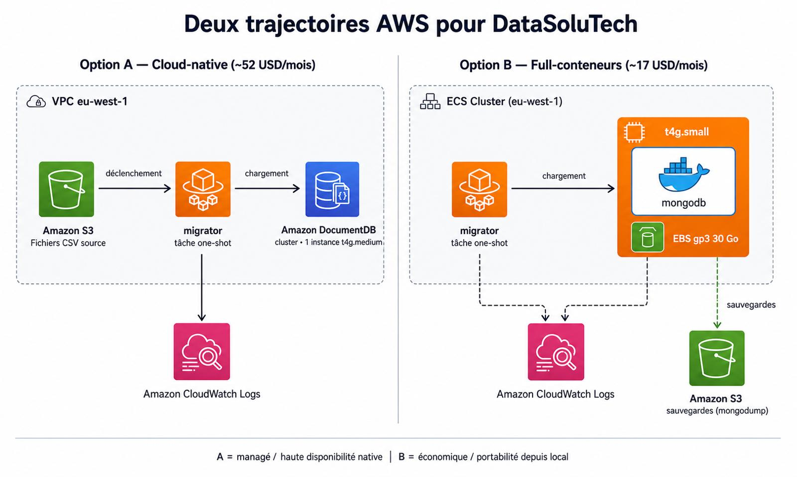

# Recherches AWS — Étape 3 du projet OPC5

> **Périmètre :** étape documentaire.  
> **Objectif :** documenter les services AWS pertinents pour faire évoluer la stack DataSoluTech vers une infrastructure cloud managée.  
> **Posture :** document neutre informatif. Aucun déploiement réel.

---

## Sommaire

- [1. Introduction](#1-introduction)
- [2. Création d'un compte AWS](#2-création-dun-compte-aws)
- [3. Tarification AWS](#3-tarification-aws)
- [4. Amazon RDS et la question MongoDB](#4-amazon-rds-et-la-question-mongodb)
- [5. Amazon DocumentDB](#5-amazon-documentdb)
- [6. Amazon ECS — déploiement de conteneurs](#6-amazon-ecs--déploiement-de-conteneurs)
- [7. Sauvegardes et monitoring](#7-sauvegardes-et-monitoring)
- [8. Synthèse](#8-synthèse)
- [Sources et références](#sources-et-références)

---

## 1. Introduction

Le présent document fait suite à la mise en place de l'environnement local de gestion des données médicales chez DataSoluTech (cf. [README](../README.md)). Il vise à éclairer les options offertes par Amazon Web Services pour faire évoluer cette stack vers une infrastructure cloud managée, en cohérence avec les enjeux de scalabilité, de sécurité et de continuité d'activité identifiés en début de mission.

Cinq sujets sont traités : la création et la prise en main d'un compte AWS, le modèle de tarification, les services managés Amazon RDS et Amazon DocumentDB, le déploiement de conteneurs Docker sur Amazon ECS, et la configuration des sauvegardes et de la supervision des bases de données.

Ce document est exclusivement documentaire et ne s'accompagne d'aucun déploiement effectif. Il a vocation à servir de base de discussion technique pour cadrer la trajectoire cloud du projet.

---

## 2. Création d'un compte AWS

### 2.1 Procédure de création

La création d'un compte AWS s'effectue depuis [aws.amazon.com](https://aws.amazon.com) via le bouton **Create an AWS Account**. La procédure demande une adresse email dédiée, un numéro de téléphone (vérifié par SMS ou appel), et **une carte bancaire valide** — y compris pour un usage exclusivement dans le cadre du free tier. AWS prélève une autorisation symbolique (1 USD environ) puis l'annule, à des fins de validation.

Le compte est ouvert avec un **plan support Basic** (gratuit), suffisant pour la grande majorité des usages individuels et pour ce projet.

### 2.2 Bonnes pratiques de sécurité initiale

Trois mesures ont été appliquées dès la création du compte, conformément aux recommandations officielles d'AWS :

**1. MFA sur le compte root.** Le compte racine donne un pouvoir illimité sur l'ensemble des ressources et de la facturation. Une compromission de ses identifiants seuls (mot de passe + email) suffirait à un attaquant pour créer des ressources coûteuses ou supprimer l'ensemble des données. L'authentification à deux facteurs (TOTP via une application dédiée) bloque ce vecteur d'attaque.

**2. Création d'un utilisateur IAM dédié pour l'usage courant.** Le compte root n'est plus utilisé que pour les opérations strictement réservées (changement de moyen de paiement, fermeture du compte, modifications du contact racine). Toutes les autres opérations passent par un utilisateur IAM (`pa-admin`) rattaché à un **groupe `Administrators`** auquel est attachée la policy managée `AdministratorAccess`. Cette construction (groupe → policy → user) facilitera l'ajout futur de nouveaux utilisateurs tout en gardant un point central de gestion des permissions. Le MFA est également activé sur cet utilisateur IAM.

**3. Alertes de facturation.** Sans alerte, une dérive de coûts (instance oubliée, script en boucle, attaque réussie utilisant les ressources du compte) peut accumuler des charges importantes avant détection. Trois mécanismes complémentaires ont été configurés :
- **AWS Free Tier alerts** : notification dès qu'un service approche les limites de gratuité.
- **AWS Budgets** : un budget « Zero spend » déclenche une alerte par email dès le premier centime facturé.
- **CloudWatch billing alarm** : alarme additionnelle au seuil de 1 USD, basée sur la métrique `EstimatedCharges` (région `us-east-1`, où sont exposées les métriques de facturation), avec notification via Amazon SNS.

### 2.3 Statut actuel du compte

| Élément | Valeur |
|---|---|
| Date de création | 24 avril 2026 |
| Statut Free Tier | Actif (6 mois à compter de l'ouverture) |
| Plan support | Basic (gratuit) |
| MFA root | Activé |
| Utilisateur IAM admin | Créé, MFA activé, rattaché au groupe `Administrators` |
| Alertes de facturation | AWS Budgets (Zero-Spend) + CloudWatch alarm (1 USD) + Free Tier alerts |

---

## 3. Tarification AWS

### 3.1 Le modèle « pay as you go »

AWS facture selon un modèle de consommation : aucun engagement préalable n'est requis, et **les ressources ne sont facturées que pendant leur utilisation effective**, à la seconde, à la minute ou à l'heure selon le service. Ce modèle se traduit concrètement par trois caractéristiques :

- Aucun frais d'installation, aucun coût récurrent indépendant de l'usage.
- Une facturation détaillée par service, par région et par fonctionnalité, consultable mensuellement dans la console AWS.
- La possibilité d'arrêter ou de redimensionner les ressources à tout moment, sans pénalité.

L'absence de coût fixe rend ce modèle particulièrement adapté aux charges variables, mais expose à un risque inverse : une ressource oubliée continue d'être facturée jusqu'à sa suppression. C'est pourquoi les alertes de facturation et les budgets (cf. section 2.2) sont essentiels.

### 3.2 Les trois leviers de coût

La quasi-totalité de la facture AWS se décompose en trois grandes catégories :

| Levier | Exemples concrets | Unité de facturation |
|---|---|---|
| **Compute** | EC2, ECS Fargate, Lambda | vCPU/heure, RAM/heure, requêtes |
| **Storage** | EBS, S3, snapshots, DocumentDB volume | Go/mois |
| **Data transfer** | Sortie internet, transfert inter-région | Go transféré |

Quelques règles fréquemment méconnues à connaître :

- **L'entrée de données dans AWS est généralement gratuite**.
- **La sortie vers internet est facturée** dès qu'on dépasse une franchise.
- **Le trafic intra-région entre services AWS** (ex : ECS → DocumentDB dans la même région) est **gratuit**, alors que **le trafic inter-régions** est facturé. Cela impacte directement le choix de la région de déploiement.

#### Ordres de grandeur des principaux services

Le tableau ci-dessous présente des **ordres de grandeur** pour les services évoqués dans ce document, en région **eu-west-1 (Irlande)**, à titre indicatif (mai 2026) :

| Service | Configuration | Tarif on-demand approximatif |
|---|---|---|
| **ECS Fargate** | par task : vCPU + RAM | ~0,04 USD/vCPU-h + ~0,0044 USD/Go-h |
| **ECS Fargate Spot** | task interruptible | jusqu'à -70 % vs on-demand |
| **EC2 t4g.small** (Graviton ARM, 24/7) | 2 vCPU, 2 Go RAM | ~0,019 USD/h (~14 USD/mois) |
| **EC2 t4g.medium** (Graviton ARM, 24/7) | 2 vCPU, 4 Go RAM | ~0,038 USD/h (~28 USD/mois) |
| **DocumentDB** (instance) | `db.t4g.medium` (2 vCPU, 4 Go) | ~0,07 USD/h (~51 USD/mois en 24/7) |
| **DocumentDB** (instance) | `db.r6g.large` (2 vCPU, 16 Go) | ~0,30 USD/h (~219 USD/mois en 24/7) |
| **DocumentDB** (storage) | volume cluster | ~0,10 USD/Go-mois |
| **DocumentDB** (I/O) | requêtes lecture/écriture | ~0,20 USD/million d'I/O |
| **Lightsail Container Service** (Nano) | 0,25 vCPU, 512 Mo RAM, 1 nœud | ~7 USD/mois (forfait 24/7) |
| **Lightsail Container Service** (Micro) | 0,25 vCPU, 1 Go RAM, 1 nœud | ~10 USD/mois (forfait 24/7) |
| **Lightsail Container Service** (Small) | 0,5 vCPU, 2 Go RAM, 1 nœud | ~20 USD/mois (forfait 24/7) |
| **Amazon S3 Standard** | stockage | ~0,023 USD/Go-mois |
| **Amazon S3** (requêtes) | PUT/GET | ~0,005 USD pour 1 000 PUT, ~0,0004 USD pour 1 000 GET |
| **EBS gp3** | volume SSD général | ~0,08 USD/Go-mois |
| **EFS Standard** | stockage de fichiers | ~0,30 USD/Go-mois |
| **CloudWatch Logs** | ingestion + stockage | ~0,50 USD/Go ingéré + ~0,03 USD/Go-mois |
| **Data transfer out** | sortie internet (au-delà des 100 Go offerts) | ~0,09 USD/Go (dégressif au volume) |

> Ces prix sont indicatifs et **évoluent fréquemment**. Pour toute estimation engageante, se référer à l'AWS Pricing Calculator (cf. section 3.4) et aux pages tarifaires officielles de chaque service.

### 3.3 Le programme Free Tier

**AWS a refondu son programme Free Tier le 15 juillet 2025**. Le modèle historique (12 mois d'allocations gratuites sur EC2, RDS, S3) n'est plus disponible pour les nouveaux comptes. Le présent document décrit le **modèle en vigueur**, applicable aux comptes créés après cette date.

#### Trois composantes

**1. Crédits de bienvenue (jusqu'à 200 USD).** À l'inscription, le client reçoit 100 USD de crédits, et peut en gagner 100 USD supplémentaires en complétant cinq activités d'onboarding (par exemple : configurer un budget, déployer une première instance EC2, etc.). Les crédits expirent **6 mois après la création du compte**. Ils sont consommables sur la majorité des services.

**2. Always Free (services toujours gratuits).** Plus de 30 services sont **gratuits dans la limite de quotas mensuels**, indépendamment de l'âge du compte. Les principaux pour un projet comme celui de DataSoluTech :

| Service | Quota gratuit mensuel |
|---|---|
| AWS Lambda | 1 million de requêtes + 400 000 GB-secondes de calcul |
| Amazon DynamoDB | 25 Go de stockage |
| Amazon S3 | 5 Go en classe Standard |
| Amazon CloudFront | 1 To de sortie + 10 millions de requêtes |
| Amazon SNS | 1 million de publications |
| Amazon CloudWatch | 10 métriques personnalisées + 10 alarmes |

**3. Trials (essais limités).** Certains services offrent une période d'essai démarrant à la première activation : par exemple Amazon SageMaker, Amazon Redshift Serverless, ou Amazon Lightsail. Les durées vont de 15 jours à 3 mois selon le service.

#### Free Plan vs Paid Plan

À la création d'un nouveau compte, AWS demande de choisir un plan :

- **Free Plan** : gratuit pour 6 mois maximum (ou jusqu'à épuisement des crédits, selon ce qui survient en premier). Limite l'accès aux services les plus coûteux. Le compte est automatiquement clôturé en fin de période sauf upgrade vers un Paid Plan.
- **Paid Plan** : accès complet à tous les services. Les crédits Free Tier sont automatiquement appliqués sur la facture. Si la consommation dépasse les crédits, le tarif standard pay-as-you-go s'applique.

Pour les besoins du projet OPC5, un **Paid Plan avec crédits Free Tier** est l'option recommandée : il offre l'accès à DocumentDB et ECS (non disponibles en Free Plan), tout en bénéficiant des 200 USD de crédits initiaux.

### 3.4 Outils d'estimation et de suivi

AWS fournit deux outils principaux pour anticiper et suivre les coûts.

**AWS Pricing Calculator** ([calculator.aws](https://calculator.aws)) permet de **simuler le coût d'une architecture cible** avant tout déploiement. On y compose les services envisagés (par exemple : un cluster DocumentDB de 2 instances `db.r6g.large`, un service ECS Fargate avec 0,5 vCPU et 1 Go de RAM, 100 Go de stockage S3) et l'outil produit une estimation mensuelle détaillée. Cet exercice est indispensable avant tout passage en production : il permet d'anticiper l'ordre de grandeur et de détecter les postes les plus coûteux.

**AWS Cost Explorer** est l'outil de **suivi a posteriori** : il visualise la consommation réelle, par service, par région, par tag, sur plusieurs mois. Il propose également des projections sur les mois à venir, basées sur les tendances. Pour DataSoluTech, l'usage de tags par environnement (`env=prod`, `env=dev`) permettrait de distinguer rapidement les coûts.

### 3.5 Estimation indicative pour DataSoluTech

L'exercice ci-dessous applique les tarifs présentés en 3.2 aux deux options d'architecture envisagées en section 6.4, dans le but de fournir un **premier ordre de grandeur** au commanditaire.

#### Hypothèses de dimensionnement

La consigne ne donne pas d'indication chiffrée de volumétrie ou de charge cible. Les hypothèses suivantes sont **assumées** sur la base du seul matériau disponible :

- **Volumétrie actuelle** : 54 966 documents en base (~30 Mo). Provient du dataset Kaggle utilisé.
- **Anticipation pré-production** : volumétrie projetée à environ **1 Go** sur un horizon de 6 à 12 mois (croissance × 30), pour absorber l'arrivée de nouveaux jeux de données médicales sans redimensionnement immédiat.
- **Fréquence d'exécution du pipeline** : **1 migration par semaine** (charge ponctuelle, type batch ETL).
- **Charge applicative** : accès analystes ponctuels en lecture seule (cf. rôle `analyst_user` défini en étape 2). Pas de service applicatif temps réel à ce stade.
- **Région** : **eu-west-1** (Irlande), région européenne la plus proche du client supposé en France et offrant l'éventail complet de services.
- **Haute disponibilité** : non requise en pré-production. Les options multi-AZ ne sont pas chiffrées ici.

> Toute estimation ci-dessous évolue significativement si l'une de ces hypothèses change. Pour un cadrage engageant, l'AWS Pricing Calculator avec les hypothèses spécifiques de DataSoluTech reste l'outil de référence.

#### Choix du compute selon le profil de charge

ECS lui-même ne fournit pas le calcul : il pilote des conteneurs qui s'exécutent sur un compute fourni par une autre brique AWS. Trois options sont disponibles, chacune adaptée à un profil de charge différent :

- **ECS sur Fargate** : compute serverless, facturé à la seconde sur les ressources réellement consommées. Idéal pour les charges ponctuelles ou très variables ; coûteux pour un service permanent 24/7.
- **ECS sur EC2** : le client provisionne lui-même les instances EC2 sur lesquelles ECS distribue les conteneurs. Plus économique pour les charges stables 24/7, mais introduit la gestion de l'OS et de la capacité.
- **ECS Managed Instances** : compromis récent où AWS gère les instances EC2 sous-jacentes tout en laissant le choix du type au client.

Pour un conteneur MongoDB léger fonctionnant en continu, le tableau suivant compare les options à dimensionnement équivalent (~2 vCPU, 2 Go RAM, suffisant pour la volumétrie projetée) :

| Option | Configuration | Coût mensuel approximatif | Remarque |
|---|---|---|---|
| ECS Fargate 24/7 | 0,5 vCPU + 1 Go RAM | ~18 USD | Surcoût lié à la facturation à la seconde sur charge permanente |
| **ECS sur EC2** (`t4g.small`) | 2 vCPU + 2 Go RAM | **~14 USD** | **Choix retenu pour Option B** |
| ECS Managed Instances (équivalent t4g.small) | 2 vCPU + 2 Go RAM | ~15 USD | Léger surcoût, AWS gère l'OS |

Le choix retenu est **ECS sur EC2 avec une instance `t4g.small`** : c'est l'option la moins coûteuse pour un service 24/7, tout en restant strictement dans le périmètre ECS demandé. L'instance Graviton (ARM) offre un meilleur rapport prix/performance que les instances x86 équivalentes, et 2 Go de RAM offrent une marge confortable pour un MongoDB hébergeant ~1 Go de données.

Le **migrator**, qui s'exécute ponctuellement (5 minutes par semaine), reste en revanche dimensionné en **Fargate** : la facturation à la seconde le rend imbattable pour ce type de charge ponctuelle (~0,005 USD/exécution). Cette combinaison (Fargate pour le job ponctuel + EC2 pour le service permanent) est l'arbitrage standard sur ECS.

#### Option A — Architecture cloud-native (DocumentDB + S3)

| Composant | Configuration | Estimation mensuelle |
|---|---|---|
| DocumentDB — 1 instance `db.t4g.medium` (24/7) | 2 vCPU, 4 Go RAM | ~51 USD |
| DocumentDB — stockage volume | ~1 Go (données + index + métadonnées) | ~0,10 USD |
| DocumentDB — I/O | très faibles (charge ponctuelle hebdo) | < 1 USD |
| ECS Fargate — pipeline migrator | 4 exécutions × 5 min × (0,5 vCPU + 1 Go) | ~0,02 USD |
| Amazon S3 — stockage CSV source | 1 Go Standard | ~0,03 USD |
| CloudWatch Logs | < 1 Go ingéré | < 0,50 USD |
| **Total estimé** | | **~52 USD / mois** |

> Hors crédits Free Tier, qui couvrent une part significative ces premiers mois.

#### Option B — Architecture full-conteneurs (MongoDB sur ECS/EC2)

| Composant | Configuration | Estimation mensuelle |
|---|---|---|
| ECS sur EC2 — instance `t4g.small` (24/7) pour MongoDB | 2 vCPU + 2 Go RAM | ~14 USD |
| EBS gp3 — volume racine de l'instance EC2 | 20 Go | ~1,60 USD |
| ECS Fargate — pipeline migrator | 4 exécutions × 5 min × (0,5 vCPU + 1 Go) | ~0,02 USD |
| Snapshots / sauvegardes (`mongodump` planifié vers S3) | ~1 Go en S3 + scripts | < 0,50 USD |
| CloudWatch Logs | < 1 Go ingéré | < 0,50 USD |
| **Total estimé** | | **~17 USD / mois** |

> À ce coût s'ajoute le **temps de l'équipe** pour l'opération (gestion de l'instance EC2, sauvegardes, mises à jour Mongo, surveillance), non valorisé ici. L'instance EC2 t4g.small est par ailleurs éligible aux remises Reserved Instances (jusqu'à -40 % sur engagement 1 an).

#### Lecture du comparatif

À volumétrie modeste, l'**Option B est environ trois fois moins coûteuse** en facturation directe AWS (~17 USD/mois contre ~52 USD), parce qu'elle évite l'instance minimale incompressible de DocumentDB et utilise une instance EC2 de petite taille (Graviton ARM) pour héberger le conteneur MongoDB.

Cet écart se réduit puis s'inverse mécaniquement dès que :

- la volumétrie progresse (DocumentDB scale plus efficacement que MongoDB self-hosted sur une seule instance EC2) ;
- les exigences de haute disponibilité imposent du multi-AZ (gratuit côté DocumentDB, à implémenter manuellement côté Option B avec replica set sur plusieurs EC2) ;
- les exigences de SLA imposent du monitoring avancé (Performance Insights, alarmes fines), qu'il faut intégrer manuellement côté Option B ;
- le coût opérationnel des équipes de maintenance est intégré au calcul (patching OS, gestion de la capacité, sauvegardes scriptées).

Cette estimation est donc à lire comme un **point de départ pour un environnement de pré-production léger**. Pour un cadrage plus fin, l'AWS Pricing Calculator avec les hypothèses spécifiques de DataSoluTech (taux de croissance, exigences RTO/RPO, multi-AZ, audit applicatif) est indispensable.

### 3.6 Optimisations possibles

Au-delà du modèle on-demand par défaut, AWS propose plusieurs leviers de réduction des coûts pour les charges stables ou prévisibles :

- **Reserved Instances** : engagement sur 1 ou 3 ans pour des ressources EC2 ou RDS, en échange d'une remise pouvant atteindre 75 %.
- **Savings Plans** : engagement sur un volume horaire de dépenses (en USD/heure) plutôt que sur des instances précises, plus flexible.
- **Spot Instances** : capacité EC2 non garantie (peut être interrompue), facturée jusqu'à 90 % moins cher, adaptée aux charges interruptibles (batchs, traitements distribués).

Ces options ne sont pas pertinentes en phase de prototypage ou pour des charges ponctuelles, mais peuvent transformer significativement le coût d'une exploitation à charge soutenue.

---

## 4. Amazon RDS et la question MongoDB

### 4.1 Qu'est-ce qu'Amazon RDS ?

Amazon Relational Database Service (RDS) est l'offre AWS de bases de données relationnelles managées. « Managé » signifie que les opérations habituellement à la charge d'un administrateur (provisionnement de l'infrastructure, application des correctifs OS et moteur, sauvegardes automatisées, monitoring, bascule en cas de panne) sont prises en charge par AWS.

Le bénéfice direct est de pouvoir consacrer le temps des équipes techniques à la modélisation et à l'exploitation des données plutôt qu'à l'opération du moteur lui-même. Pour DataSoluTech, qui n'a pas vocation à devenir un opérateur de bases de données, c'est un argument de fond.

### 4.2 Moteurs supportés

RDS propose six moteurs :

| Moteur | Famille |
|---|---|
| Amazon Aurora (compatible MySQL/PostgreSQL) | Relationnel — propriétaire AWS |
| MySQL | Relationnel — open source |
| PostgreSQL | Relationnel — open source |
| MariaDB | Relationnel — open source |
| Oracle Database | Relationnel — propriétaire |
| Microsoft SQL Server | Relationnel — propriétaire |

L'ensemble de ces moteurs partagent une caractéristique commune : ce sont tous des **systèmes de gestion de bases de données relationnelles** (SGBDR). Ils s'appuient sur le modèle tabulaire et le langage SQL.

### 4.3 Pourquoi MongoDB n'est pas sur RDS

MongoDB est une base **NoSQL orientée documents**. Son modèle de données (documents BSON imbriqués), son langage de requête (basé sur des objets JSON et non sur SQL) et son architecture interne (sharding natif, jeux de réplicas) sont fondamentalement différents des moteurs supportés par RDS.

Pour cette raison, **MongoDB ne fait pas partie du catalogue RDS**. RDS est l'offre managée pour les SGBDR, et un autre service est dédié aux bases de type document compatibles avec l'API MongoDB. Ce service est **Amazon DocumentDB**, présenté dans la section suivante.

À noter : il reste possible de faire tourner MongoDB sur AWS sans passer par DocumentDB, soit en self-hosted sur des instances EC2 (administration entièrement à la charge du client), soit via l'offre managée tierce **MongoDB Atlas** (proposée par MongoDB Inc., avec déploiement sur infrastructure AWS). Ces options sont évoquées en section 5.

---

## 5. Amazon DocumentDB

### 5.1 Présentation

Amazon DocumentDB (with MongoDB compatibility) est l'offre AWS de **base de données NoSQL orientée documents managée**, dont l'API est conçue pour être compatible avec celle de MongoDB. Le service permet à des applications utilisant des drivers et des outils MongoDB de fonctionner sur DocumentDB sans modification, ou avec un nombre réduit d'ajustements selon les versions et fonctionnalités utilisées.

Du point de vue d'AWS, DocumentDB joue pour le NoSQL document le rôle que RDS joue pour les SGBDR : il fournit l'infrastructure, applique les correctifs, gère la haute disponibilité, automatise les sauvegardes et expose une interface compatible avec un standard de marché.

### 5.2 Compatibilité avec MongoDB

DocumentDB supporte trois versions d'API MongoDB :

| Version DocumentDB | Compatibilité MongoDB | Statut |
|---|---|---|
| 3.6 | MongoDB 3.6 API | Fin de support standard le 30 mars 2026 (extended support disponible) |
| 4.0 | MongoDB 4.0 API | Standard |
| 5.0 | MongoDB 5.0 API | LTS (Long-Term Support) depuis février 2026 |
| 8.0 | MongoDB 8.0 API | Plus récente, gains performance significatifs (x7 latence, x5 compression) |

Un point essentiel à comprendre est qu'il s'agit d'une **réimplémentation par AWS du protocole filaire de MongoDB**, et non d'un fork ou d'une intégration de l'éditeur. Cette particularité a deux conséquences concrètes :

- La compatibilité est **partielle**. Certaines fonctionnalités MongoDB ne sont pas (ou pas encore) supportées : capped collections, opérations map-reduce, GridFS, text indexes, vector search indexes, partial indexes, certaines commandes administratives, etc. AWS publie une [liste détaillée des fonctionnalités supportées](https://docs.aws.amazon.com/documentdb/latest/developerguide/mongo-apis.html) tenue à jour.
- **MongoDB Inc. (l'éditeur officiel) ne propose pas de support commercial pour DocumentDB** et mentionne explicitement dans sa documentation que la compatibilité avec ses propres versions est incomplète. Pour DataSoluTech, cela signifie que toute évolution vers DocumentDB suppose un audit préalable du code applicatif pour identifier les éventuelles fonctionnalités MongoDB utilisées qui ne seraient pas supportées.

Pour le projet actuel de DataSoluTech (collection unique, requêtes filtrées par condition médicale, hôpital, dates, indexation classique), la compatibilité serait *a priori* suffisante. Une migration de validation serait néanmoins indispensable avant tout passage en production.

### 5.3 Architecture interne

DocumentDB repose sur une architecture distribuée propre, qui sépare la couche compute de la couche storage :

- **La couche compute** est constituée d'instances primaires (une par cluster, qui accepte les écritures) et de jusqu'à **15 instances réplicas en lecture**, distribuées sur plusieurs zones de disponibilité (AZ). Le scale-out en lecture est ainsi natif.
- **La couche storage** est mutualisée : les données sont stockées dans un volume distribué qui se redimensionne automatiquement par incréments de 10 Go, jusqu'à 128 Tio. Les données sont **répliquées six fois sur trois AZ** par défaut, avec mécanisme de quorum. Cette séparation permet aux instances de calcul d'être ajoutées, supprimées ou redémarrées sans impact sur les données.

Côté résilience, DocumentDB effectue un **backup continu vers Amazon S3** avec capacité de **point-in-time recovery (PITR)** sur les 35 derniers jours par défaut, ainsi que des snapshots manuels à la demande.

### 5.4 Cas d'usage et limites

DocumentDB est pertinent pour :

- Les **charges productives à fort volume**, où la séparation compute/storage et la réplication automatique apportent une vraie valeur.
- Les organisations **sans expertise interne en exploitation MongoDB**, qui cherchent à externaliser la couche opérationnelle.
- Les contextes où les **exigences de haute disponibilité et de récupération** sont critiques (santé, finance, etc.) — donc *a priori* alignées avec le secteur de DataSoluTech.

DocumentDB est moins pertinent pour :

- Les projets utilisant des **fonctionnalités MongoDB récentes ou peu courantes** non supportées (text search avancé, vector search, change streams complets, certaines opérations transactionnelles).
- Les **petits volumes** où les coûts incompressibles (instance minimale) dépassent ceux d'une instance MongoDB self-hosted ou d'un plan Atlas équivalent.
- Les équipes souhaitant suivre **strictement les dernières versions de MongoDB**, sachant que DocumentDB suit avec un décalage et n'implémente pas l'intégralité.

### 5.5 Alternatives à considérer

Trois options principales coexistent pour exploiter MongoDB sur AWS, qu'il convient de comparer en fonction des priorités du projet :

| Option | Bénéfices | Limites |
|---|---|---|
| **Amazon DocumentDB** | Service managé natif AWS, intégration IAM/CloudWatch/VPC simplifiée, facturation unifiée | Compatibilité MongoDB partielle, pas de support de l'éditeur |
| **MongoDB Atlas (sur AWS)** | MongoDB officiel, compatibilité totale, fonctionnalités les plus récentes (search, vector, lake) | Facturation séparée (relation contractuelle avec MongoDB Inc.), gestion du peering VPC à prévoir |
| **MongoDB self-hosted sur EC2** | Contrôle total, choix de version libre, coût minimal sur petites volumétries | Administration entièrement à la charge du client (patches, backups, HA, monitoring) |

Le choix dépend des priorités : intégration AWS et simplicité opérationnelle (DocumentDB), parité fonctionnelle avec MongoDB (Atlas), maîtrise des coûts et flexibilité (self-hosted). Pour une équipe cherchant à minimiser la charge opérationnelle tout en restant proche du standard MongoDB, **DocumentDB constitue généralement le compromis recommandé sur AWS**, sous réserve de l'audit de compatibilité évoqué plus haut.

---

## 6. Amazon ECS — déploiement de conteneurs

### 6.1 Qu'est-ce qu'Amazon ECS ?

Amazon Elastic Container Service (ECS) est le service AWS d'**orchestration de conteneurs Docker**. Il joue, pour une stack conteneurisée, un rôle équivalent à celui de Docker Compose à l'échelle locale : il décrit, déploie, scale et supervise des conteneurs sur une infrastructure adaptée.

ECS est l'alternative AWS à Kubernetes (qui dispose, par ailleurs, de son propre service AWS managé : Amazon EKS). ECS est généralement plus simple à appréhender qu'EKS et reste suffisant pour la grande majorité des cas d'usage applicatifs courants. Il s'intègre nativement avec les autres services AWS (IAM pour les permissions, CloudWatch pour les logs et métriques, ALB pour le load balancing, ECR pour le registre d'images, etc.).

À noter : **ECS lui-même est gratuit**. La facturation porte uniquement sur les ressources de calcul sous-jacentes consommées par les conteneurs.

### 6.2 Concepts clés

L'organisation d'une charge de travail sur ECS s'articule autour de quatre concepts :

| Concept | Rôle | Équivalent Docker Compose |
|---|---|---|
| **Cluster** | Groupe logique de ressources qui héberge les conteneurs | (l'environnement Compose lui-même) |
| **Task definition** | Spécification déclarative d'un conteneur (image, CPU, mémoire, variables d'environnement, ports, volumes) | Service défini dans `docker-compose.yml` |
| **Task** | Instance en cours d'exécution d'une task definition | Conteneur lancé par `docker compose up` |
| **Service** | Mécanisme qui maintient un nombre cible de tasks en exécution, gère les redémarrages et l'intégration avec un load balancer | Pas d'équivalent direct (Compose est conçu pour le single-host) |

Pour DataSoluTech, ces concepts se traduisent directement :
- Le service `migrator` actuellement défini dans `docker-compose.yml` deviendrait une **task definition** ECS.
- Le `Dockerfile.migrator` resterait inchangé.
- L'image serait poussée sur **Amazon ECR** (Elastic Container Registry).
- Une **task one-shot** serait déclenchée pour chaque exécution du pipeline (ECS supporte nativement ce pattern via les RunTask).

### 6.3 Compute sous-jacent : Fargate, EC2, ou Managed Instances

ECS ne fournit pas le calcul lui-même : il pilote des conteneurs qui s'exécutent sur un compute fourni à part. Trois options se présentent :

**Fargate (serverless)** : AWS gère intégralement les machines hôtes. Le client définit uniquement les ressources CPU et mémoire dont la task a besoin, et ne s'occupe ni de la couche OS, ni du patching, ni du capacity planning. La facturation s'effectue à la seconde sur les ressources réellement consommées par chaque task (~0,04 USD par vCPU-heure, ~0,0044 USD par Go-heure en 2026, hors région).

**EC2** : le client gère lui-même un parc d'instances EC2 sur lesquelles ECS distribue les conteneurs. Plus de contrôle (choix d'instance, GPU possible, configuration réseau fine, modèles de tarification engagés type Reserved/Spot), mais aussi plus de responsabilité opérationnelle.

**ECS Managed Instances** (option plus récente) : AWS gère les instances EC2 sous-jacentes, mais le client conserve la flexibilité de choix d'instance type. Ce mode constitue un compromis entre les deux extrêmes.

| Critère | Fargate | EC2 | Managed Instances |
|---|---|---|---|
| Gestion infrastructure | AWS | Client | AWS |
| Choix du type d'instance | Non (CPU/RAM uniquement) | Oui, complet | Oui |
| Tarification | À la seconde, par ressources consommées | À l'instance entière | À l'instance entière |
| Pertinence | Charges variables ou ponctuelles | Charges stables à fort volume | Cas intermédiaires, GPU |

À l'échelle d'un job batch ponctuel comme le `migrator`, **Fargate est généralement plus avantageux** : on ne paie que pendant l'exécution effective (quelques secondes à quelques minutes), et il n'y a pas d'instance à éteindre une fois le job terminé.

### 6.4 Application au cas DataSoluTech

### 6.4 Application au cas DataSoluTech

Deux architectures cibles peuvent être envisagées sur ECS, avec des arbitrages différents en termes de complexité, coût et niveau de service délégué à AWS.

#### Option A — Architecture cloud-native (conteneurs + services managés)

Cette option fait levier sur les services managés présentés dans ce document :

1. Le **CSV source** (ou tout autre flux de données futur) est déposé dans un bucket **Amazon S3**.
2. Le pipeline `migrator` est conteneurisé (déjà fait à l'étape 2) et l'image est publiée sur **Amazon ECR**.
3. Une **task ECS Fargate** est déclenchée à la demande (manuellement, par EventBridge sur dépôt S3, ou planifiée) pour exécuter la migration. La task lit le CSV depuis S3 et écrit dans **Amazon DocumentDB**.
4. Les **logs** de la task sont automatiquement centralisés dans **Amazon CloudWatch Logs**.
5. Une autre task ECS pourrait porter le service applicatif (API, dashboard) consommant les données depuis DocumentDB.

**Bénéfices :** chaque composant est délégué à AWS, ce qui réduit fortement la charge opérationnelle. Les sauvegardes et la haute disponibilité sont natives. C'est l'architecture la plus alignée avec les pratiques cloud actuelles.

**Points d'attention :** facture potentiellement plus élevée sur de petits volumes (DocumentDB impose une instance minimum), compatibilité MongoDB partielle (cf. section 5).

#### Option B — Architecture full-conteneurs (MongoDB en conteneur ECS)

Cette option reste plus proche de l'environnement local mis en place à l'étape 2. La consigne du projet l'évoque explicitement (« déploiement d'une instance MongoDB dans un conteneur Docker sur Amazon ECS ») :

1. Le **CSV source** est embarqué dans l'image du conteneur `migrator` (build-time), ou monté depuis le volume EBS de l'instance EC2 hôte (run-time). Le volume EBS de l'instance accueille à la fois le système, le runtime Docker et les données MongoDB persistantes.
2. Le pipeline `migrator` et **un conteneur MongoDB officiel** sont tous deux orchestrés par ECS, à partir d'images publiées sur Amazon ECR (ou directement depuis Docker Hub pour Mongo).
3. Le conteneur MongoDB persiste ses données sur le **volume EBS** de l'instance EC2 hôte, monté en bind mount Docker. Ce stockage est rapide (SSD local, latence faible) et économique. Sa contrepartie est la liaison à une seule zone de disponibilité — acceptable en pré-production, à compléter par une stratégie de réplication ou de snapshots pour un passage en production.
4. La communication entre les tasks `migrator` et `mongodb` s'effectue via **service discovery** ECS (équivalent du réseau `opc5-network` du `docker-compose.yml`).
5. Les **logs** sont également centralisés dans **CloudWatch Logs**.

**Bénéfices :** réutilisation à l'identique de la stack locale (mêmes images, même configuration d'authentification, même `init-users.js`), portabilité totale entre environnements, courbe d'apprentissage AWS plus douce.

**Points d'attention nombreux :**
- **Persistance liée à une AZ** : le volume EBS est lié à la zone de disponibilité (AZ) de l'instance EC2 hôte ; la perte de l'AZ entraîne l'indisponibilité de la base. Pour un passage en production, des solutions de replica set MongoDB sur plusieurs EC2/AZ ou de snapshots EBS cross-AZ devraient être mises en place. EFS contourne cela mais avec un impact en latence.
- **Sauvegardes** : à mettre en place manuellement (script `mongodump` planifié, snapshots EBS, ou AWS Backup), là où DocumentDB les fournit nativement.
- **Haute disponibilité** : la mise en place d'un replica set MongoDB sur plusieurs tasks ECS est techniquement possible mais nettement plus complexe que la HA native de DocumentDB.
- **Sécurité** : le conteneur Mongo doit être placé dans un sous-réseau privé du VPC, sans exposition publique. La gestion des secrets (mots de passe) bascule vers **AWS Secrets Manager** plutôt que des variables d'environnement.
- **Patching et upgrades** : restent à la charge de l'équipe (mise à jour de l'image, restart contrôlé, vérification de compatibilité), comme pour toute base self-hosted.

Cette architecture est viable pour un environnement de développement, de pré-production, ou un MVP à faible volumétrie. Pour une production à charge soutenue dans le secteur médical, elle expose à un coût opérationnel non négligeable que l'Option A absorbe par la délégation à un service managé.

#### Synthèse comparée

| Critère | Option A (DocumentDB + S3) | Option B (MongoDB + EFS/EBS) |
|---|---|---|
| Niveau de service délégué à AWS | Maximum | Minimum |
| Coût initial (faible volume) | Plus élevé (instance min DocumentDB) | Plus bas |
| Coût à charge soutenue | Compétitif | Comparable, voire plus élevé avec opérations |
| Effort opérationnel | Faible (managé) | Significatif (à la charge de l'équipe) |
| Compatibilité MongoDB | Partielle (cf. section 5) | Totale (Mongo officiel) |
| Sauvegardes / HA | Natives | À implémenter |
| Portabilité de la stack actuelle | Adaptation requise | Reprise quasi à l'identique |

Le choix entre les deux options dépend du profil de risque accepté, du budget, et des compétences disponibles côté exploitation. Pour DataSoluTech, une **trajectoire en deux temps** est envisageable : démarrage en Option B (proche de l'existant, montée en compétence progressive sur ECS), puis migration vers l'Option A si la charge applicative et les exigences de SLA le justifient.

---

## 7. Sauvegardes et monitoring

### 7.1 Sauvegardes

La protection des données du projet repose sur trois mécanismes complémentaires : sauvegardes automatiques natives au service, sauvegardes manuelles à la demande, et orchestration centralisée via AWS Backup.

#### Sauvegardes natives Amazon DocumentDB

DocumentDB effectue un **backup continu et incrémental vers Amazon S3**, géré par AWS et invisible côté client (les buckets ne sont pas accessibles directement). Cette mécanique permet :

- Une **rétention paramétrable de 1 à 35 jours** (1 jour par défaut, configurable à la création ou par modification ultérieure du cluster).
- Un **point-in-time recovery (PITR)** à la seconde sur toute la fenêtre de rétention. Le restore crée un nouveau cluster (les instances sont à recréer après).
- Aucun impact sur les performances du cluster source pendant le backup.

Les **snapshots manuels** complètent ce dispositif pour la rétention longue (au-delà de 35 jours), les sauvegardes pré-déploiement, ou les transferts cross-region/cross-account. Ils sont conservés indépendamment du cycle de vie du cluster.

À noter : DocumentDB ne propose pas de **récupération item-level** native (impossible de restaurer un seul document depuis un snapshot). Le contournement consiste à restaurer le cluster sur un identifiant temporaire, à extraire les éléments souhaités via `mongodump`, puis à les réinjecter dans le cluster de production.

#### Sauvegardes des autres composants

Pour les autres briques de l'architecture cible :

| Composant | Mécanisme de sauvegarde |
|---|---|
| Volumes EBS (option B avec MongoDB conteneurisé) | Snapshots EBS, stockés dans S3, incrémentaux |
| Volumes EFS | AWS Backup ou snapshots natifs EFS |
| Buckets S3 (CSV source) | Versioning + Lifecycle rules vers S3 Glacier |
| Conteneurs (images) | Conservation dans Amazon ECR, immuables |

#### Orchestration centralisée : AWS Backup

**AWS Backup** fournit une couche unifiée pour gérer les politiques de rétention sur l'ensemble des services compatibles (DocumentDB, EBS, EFS, RDS, S3, etc.). Il permet de :

- Définir des **plans de sauvegarde** centralisés (fréquence, fenêtre, rétention) appliqués à plusieurs ressources via des tags.
- **Copier les snapshots cross-region et cross-account** en une opération, utile pour la conformité et la résilience aux incidents régionaux.
- Stocker les sauvegardes dans des **vaults logiquement isolés** (« logically air-gapped vaults »), pertinents pour la défense contre les attaques ransomware.

Pour DataSoluTech, AWS Backup permettrait de centraliser la sauvegarde des données médicales (DocumentDB) et celle des fichiers sources (S3), avec une politique unique alignée sur les exigences réglementaires du secteur.

### 7.2 Monitoring

#### Amazon CloudWatch Metrics

CloudWatch Metrics centralise les métriques techniques de tous les services AWS exploités. Les métriques sont publiées toutes les 1 à 5 minutes selon le service, avec une rétention de 15 mois.

Pour l'architecture cible, les métriques utiles incluent :

| Service | Métriques clés |
|---|---|
| ECS / Fargate | `CPUUtilization`, `MemoryUtilization`, nombre de tasks running |
| DocumentDB | `CPUUtilization`, `DatabaseConnections`, `BufferCacheHitRatio`, `ReadLatency`, `WriteLatency` |
| EBS / EFS | `VolumeReadOps`, `VolumeWriteOps`, débit en Mio/s |
| S3 | nombre de requêtes, latence, taille du bucket |

Sur la base de ces métriques, des **alarmes CloudWatch** peuvent être configurées (seuils statiques ou détection d'anomalies par machine learning) pour notifier l'équipe via Amazon SNS (email, SMS, intégration Slack via Lambda).

#### Amazon CloudWatch Logs

CloudWatch Logs centralise la sortie standard des conteneurs ECS, à condition d'avoir configuré le **log driver `awslogs`** dans la task definition. Les logs sont indexés, filtrables, et retenus selon une politique configurable (par défaut indéfiniment, à ajuster pour maîtriser les coûts).

Pour le pipeline `migrator`, les logs structurés produits par `src/migrate.py` (déjà horodatés et catégorisés en local dans `logs/`) seraient automatiquement remontés à CloudWatch Logs sans modification du code.

Des **filtres de métriques** permettent de générer des métriques numériques à partir d'expressions trouvées dans les logs (par exemple : nombre de migrations échouées par heure), qui peuvent à leur tour déclencher des alarmes.

#### Performance Insights pour DocumentDB

DocumentDB intègre **Performance Insights**, un tableau de bord dédié qui présente :

- La **charge en temps réel** sur le cluster (Database Load), décomposée par utilisateur, requête, ou type d'attente.
- L'identification des **requêtes les plus lentes** (top SQL/Mongo queries).
- L'historique sur 7 jours (gratuit) ou 24 mois (payant).

C'est un outil de diagnostic indispensable en exploitation réelle, qui complète les métriques CloudWatch.

### 7.3 Bonnes pratiques

Trois familles d'alertes critiques sont à mettre en place sur tout environnement de production :

1. **Alertes de facturation** (déjà couvertes en section 2.2 pour le compte de développement) : déclencheur au moindre dépassement budgétaire.
2. **Alertes de performance** : seuils sur CPU, mémoire, latence des bases de données. Tendance à privilégier la détection d'anomalies plutôt que les seuils statiques pour réduire le bruit.
3. **Alertes de sécurité** : via CloudTrail (audit des appels API) et GuardDuty (détection de menaces), notifications sur les actions privilégiées et les comportements suspects.

Une règle opérationnelle complète l'ensemble : **tester les restaurations régulièrement**. Une sauvegarde qui n'a jamais été restaurée n'est pas une sauvegarde, c'est une présomption de sauvegarde. Pour DataSoluTech, un exercice de PITR mensuel sur un environnement de pré-production permet de vérifier que la chaîne complète (snapshot → restore → reprise applicative) fonctionne avant qu'un incident réel ne survienne.

---

## 8. Synthèse

### 8.1 Vue d'ensemble — services AWS retenus pour DataSoluTech

Le tableau suivant récapitule les services Amazon Web Services présentés dans ce document et leur rôle dans une trajectoire cloud pour DataSoluTech :

| Besoin métier ou technique | Service AWS retenu | Section |
|---|---|---|
| Hébergement managé d'une base NoSQL compatible MongoDB | Amazon DocumentDB | 5 |
| Orchestration de conteneurs Docker | Amazon ECS | 6 |
| Compute permanent à coût maîtrisé (Mongo conteneurisé) | EC2 (`t4g.small`) sous ECS | 3, 6 |
| Compute ponctuel pour pipelines batch | ECS Fargate | 3, 6 |
| Stockage des fichiers source (Option A) | Amazon S3 | 6 |
| Stockage persistant local du conteneur MongoDB (Option B) | Amazon EBS gp3 | 6 |
| Registre d'images Docker | Amazon ECR | 6 |
| Sauvegarde centralisée multi-services | AWS Backup | 7 |
| Métriques et alarmes | Amazon CloudWatch Metrics | 7 |
| Centralisation des logs | Amazon CloudWatch Logs | 7 |
| Diagnostic de performance des bases | Performance Insights (DocumentDB) | 7 |
| Gestion des permissions | AWS IAM | 2 |
| Suivi et alertes de coûts | AWS Budgets + CloudWatch Billing Alarms | 2, 3 |

### 8.2 Deux trajectoires possibles, deux niveaux d'ambition

L'analyse met en lumière deux architectures cohérentes pour porter la stack actuelle de DataSoluTech vers AWS :

- **Option A (cloud-native)** : DocumentDB + ECS Fargate + S3 + AWS Backup. Maximisation de la délégation à AWS, charge opérationnelle minimale, coût plus élevé (~52 USD/mois en pré-production), parfaite intégration native des sauvegardes et de la haute disponibilité. Architecture cible recommandée pour une exploitation pérenne dans le secteur médical.
- **Option B (full-conteneurs)** : MongoDB sur ECS/EC2 + Fargate pour le migrator + EBS local. Reprise quasi à l'identique de la stack locale conçue lors de l'étape 2 (mêmes images, même `init-users.js`, même schéma), coût plus bas (~17 USD/mois en pré-production), charge opérationnelle plus importante (gestion EC2, sauvegardes manuelles, pas de HA native).

L'arbitrage entre les deux options dépend du **profil de risque accepté**, du **budget alloué** et des **compétences disponibles** côté exploitation. Une trajectoire en deux temps reste envisageable : démarrage en Option B pour minimiser le coût initial et capitaliser sur le travail de l'étape 2, puis migration vers l'Option A lorsque la charge applicative ou les exigences de SLA le justifient.

### 8.3 Périmètre du document

Le présent document est strictement **documentaire** : aucun déploiement effectif n'a été réalisé sur AWS. Les estimations de coûts présentées sont **indicatives** (mai 2026, région eu-west-1) et basées sur des hypothèses explicitées en section 3.5. Pour tout cadrage engageant, l'AWS Pricing Calculator avec les hypothèses définitives du projet reste l'outil de référence.

L'environnement local mis en place lors des étapes 1 et 2 du projet (Docker Compose + MongoDB conteneurisé + pipeline Python conteneurisé + tests pytest) reste **directement portable** vers les deux architectures cibles décrites dans ce document. C'est l'un des bénéfices structurels de la conteneurisation systématique adoptée dès le départ.

Pour aller plus loin, ce document renvoie au [README](../README.md) du projet pour le contexte technique de la stack actuelle, et au [DECISIONS.md](../DECISIONS.md) pour la traçabilité des choix techniques effectués au cours des étapes 1 et 2.

---

## Sources et références

L'ensemble des recherches documentaires a été effectué entre le 28 avril et le 2 mai 2026. Les sources sont classées par section pour faciliter la traçabilité.

### Documentation officielle AWS

#### Compte et sécurité (section 2)

- AWS Identity and Access Management (IAM) — Create an IAM user in your AWS account : <https://docs.aws.amazon.com/IAM/latest/UserGuide/id_users_create.html>
- AWS Identity and Access Management (IAM) — Setting up your AWS account : <https://docs.aws.amazon.com/IAM/latest/UserGuide/getting-started-account-iam.html>
- Amazon CloudWatch — Create a billing alarm to monitor your estimated AWS charges : <https://docs.aws.amazon.com/AmazonCloudWatch/latest/monitoring/monitor_estimated_charges_with_cloudwatch.html>

#### Tarification et Free Tier (section 3)

- AWS Free Tier — Page officielle : <https://aws.amazon.com/free/>
- AWS Free Tier Terms : <https://aws.amazon.com/free/terms/>
- AWS Free Tier FAQs : <https://aws.amazon.com/free/free-tier-faqs/>
- AWS Billing — Explore AWS services with AWS Free Tier : <https://docs.aws.amazon.com/awsaccountbilling/latest/aboutv2/free-tier.html>
- AWS Free Tier update — New customers can get started and explore AWS with up to $200 in credits (annonce du 15 juillet 2025) : <https://aws.amazon.com/blogs/aws/aws-free-tier-update-new-customers-can-get-started-and-explore-aws-with-up-to-200-in-credits/>
- Amazon DocumentDB Pricing : <https://aws.amazon.com/documentdb/pricing/>
- AWS Pricing Calculator : <https://calculator.aws>

#### Amazon DocumentDB (section 5)

- Amazon DocumentDB — Compatibility with MongoDB : <https://docs.aws.amazon.com/documentdb/latest/developerguide/compatibility.html>
- Amazon DocumentDB — Annonce LTS sur version 5.0 (février 2026) : <https://aws.amazon.com/about-aws/whats-new/2026/02/announcing-amazon-documentdb-5-0-long-term-support/>
- Amazon DocumentDB — In-place upgrade 5.0 to 8.0 (avril 2026) : <https://aws.amazon.com/about-aws/whats-new/2026/04/amazon-documentdb-mongodb-in-place-version-upgrade-5-0-to-8-0/>
- Amazon DocumentDB — Extended Support pour version 3.6 : <https://aws.amazon.com/blogs/database/announcing-extended-support-for-amazon-documentdb-with-mongodb-compatibility-version-3-6/>
- MongoDB Inc. — Documentation officielle sur la compatibilité avec DocumentDB : <https://www.mongodb.com/docs/drivers/documentdb-support/>

#### Amazon ECS (section 6)

- Amazon Elastic Container Service — Launch types and capacity providers : <https://docs.aws.amazon.com/AmazonECS/latest/developerguide/capacity-launch-type-comparison.html>
- AWS Containers Blog — Theoretical cost optimization by Amazon ECS launch type : <https://aws.amazon.com/blogs/containers/theoretical-cost-optimization-by-amazon-ecs-launch-type-fargate-vs-ec2/>

#### Sauvegardes et monitoring (section 7)

- Amazon DocumentDB — Backing up and restoring : <https://docs.aws.amazon.com/documentdb/latest/developerguide/backup_restore.html>
- Amazon DocumentDB — Restoring to a point in time : <https://docs.aws.amazon.com/documentdb/latest/developerguide/backup_restore-point_in_time_recovery.html>
- AWS Backup — Restoring a DocumentDB cluster : <https://docs.aws.amazon.com/aws-backup/latest/devguide/restoring-docdb.html>
- AWS Storage Blog — Manage backup and restore of Amazon DocumentDB with AWS Backup : <https://aws.amazon.com/blogs/storage/manage-backup-and-restore-of-amazon-documentdb-with-aws-backup/>
- AWS Backup — Cross-region database snapshot copy to logically air-gapped vaults (février 2026) : <https://aws.amazon.com/about-aws/whats-new/2026/02/aws-backup-adds-cross-region-database-snapshot-logically-air-gapped-vaults/>

### Articles et analyses tiers consultés

- Towards The Cloud — Amazon ECS vs AWS Fargate: Complete Guide to Launch Types (mars 2026) : <https://towardsthecloud.com/blog/amazon-ecs-vs-aws-fargate>
- StormIT — AWS Fargate vs Amazon EC2 (février 2026) : <https://www.stormit.cloud/blog/aws-fargate-vs-ec2/>
- CloudWebSchool — AWS Free Tier in 2026: Credits, Limits, and Hidden Costs (mars 2026) : <https://cloudwebschool.com/docs/aws/fundamentals/aws-free-tier/>
- Vantage Instances — db.t4g.medium pricing and specs : <https://instances.vantage.sh/aws/rds/db.t4g.medium>

### Ressources pédagogiques (cadrage initial)

- AWS — Qu'est-ce que le stockage dans le cloud ? : <https://aws.amazon.com/fr/what-is/cloud-storage/>

### Note sur la fraîcheur des informations

Les services AWS, leurs tarifs et les conditions du Free Tier évoluent fréquemment. Les chiffres et fonctionnalités présentés dans ce document reflètent l'état au **2 mai 2026**. Pour tout cadrage engageant à une date ultérieure, il est nécessaire de vérifier les pages tarifaires officielles et la documentation à jour des services.

---

*Document rédigé dans le cadre du projet OPC5 — formation Data Engineer OpenClassrooms.*  
*Auteur : Paul-Alexandre Annonay.*  
*Dernière mise à jour : 02/05/2026.*